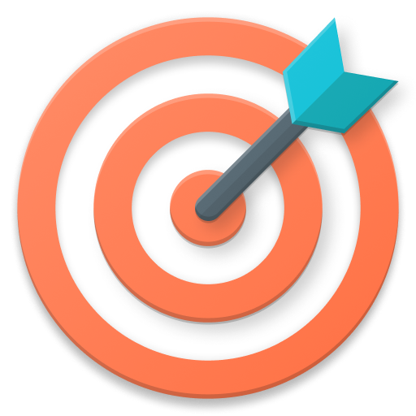
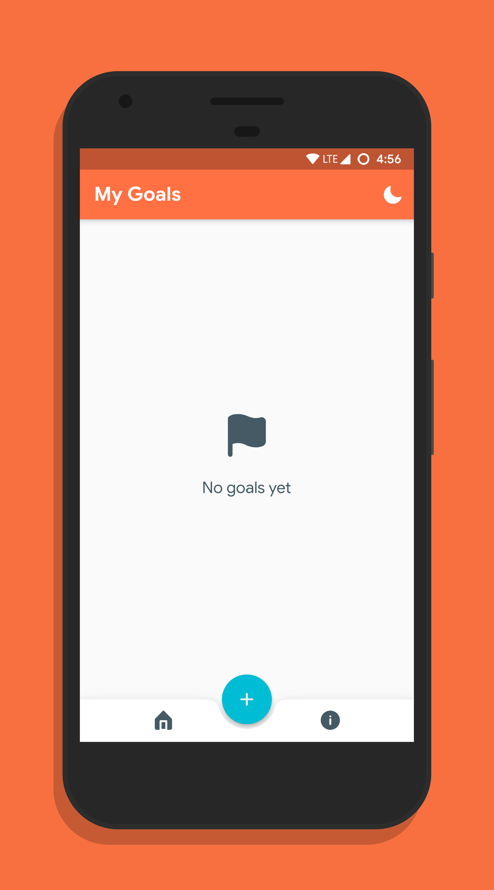
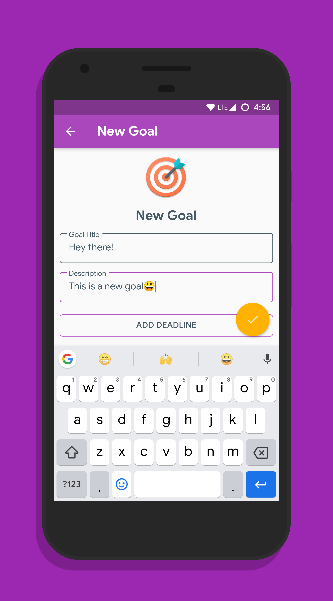
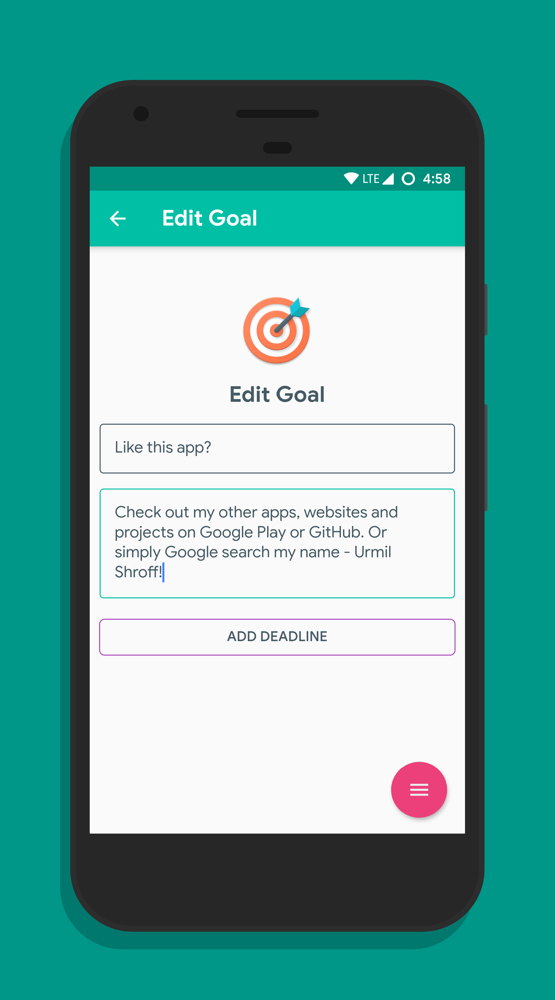
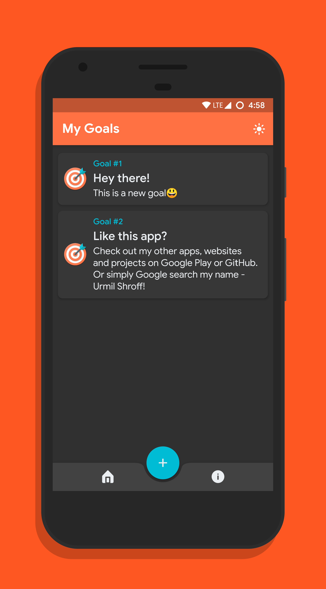

# Goalkeeper🎯

A neat, nice looking Flutter app to keep track of your goals! It can be built for iOS and Android, and is available for free on the [Play Store](https://play.google.com/store/apps/details?id=tech.urmilshroff.goalkeeper).

Not only was this my first major Flutter app, but also the first real, working mobile app that I developed and published. Nostalgia!

## Screenshots

    

## Building

To build and run the app on your device, do the following:

-   [Install Flutter](https://flutter.dev/docs/get-started/install/) by following the instructions on their website.
-   Fork/clone this repo to your local machine using `git clone https://github.com/urmilshroff/goalkeeper.git`.
-   Connect your devices/emulators and run the app using `flutter run --release` in the root of the project directory.

Note: you can also run it faster in debug mode using `flutter run`, but the animations will be choppy and performance won't be as expected.

## Contributing

Found any bugs? Have any suggestions or code improvements? [Submit an issue](https://github.com/urmilshroff/goalkeeper/issues) or fork and send a [pull request](https://github.com/urmilshroff/goalkeeper/pulls) with your changes. All contributions are more than welcome, and will be merged into `flutter` (the default branch) if satisfactory.

## Credits

Shoutout to [Arabi Ishaque](https://dribbble.com/Arabi) for updating the icon and banner! Please take a look at the list of [contributors](https://github.com/urmilshroff/goalkeeper/graphs/contributors) to see who all have helped with the project directly.

## License

This project is licensed under the MIT License - see the [LICENSE](LICENSE) file for details.
