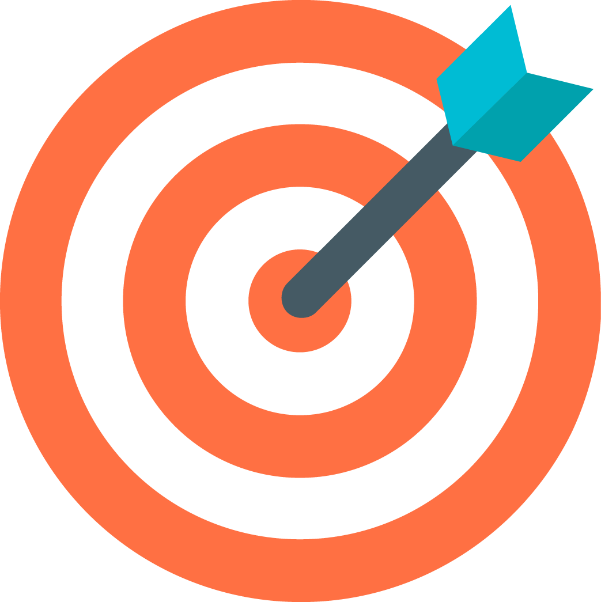
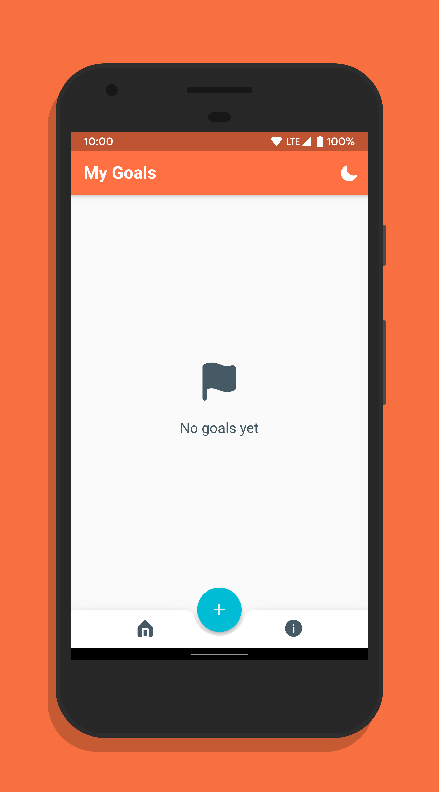
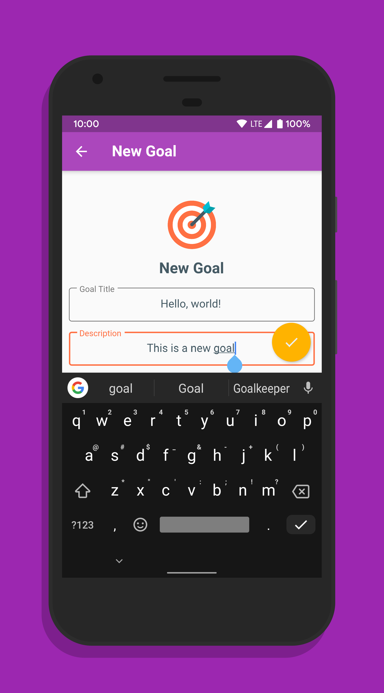
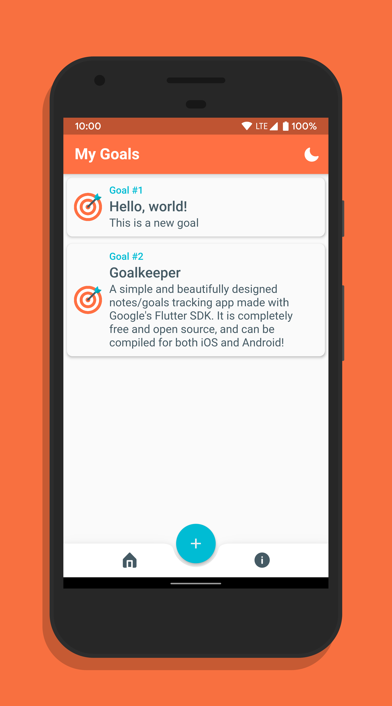
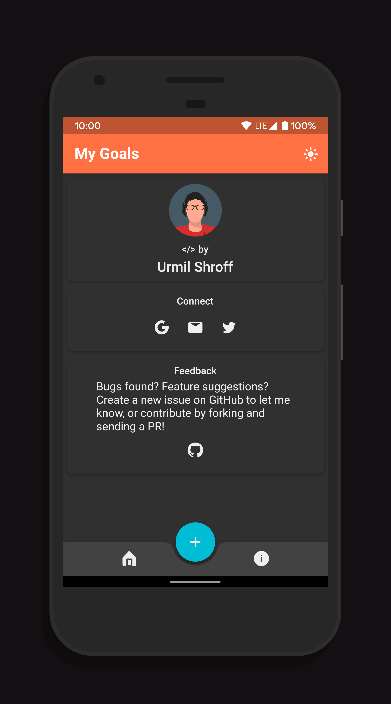

# Goalkeeper

A simple Flutter app to keep track of your goals! Can be built for iOS and Android, and available for free on the [Play Store](https://play.google.com/store/apps/details?id=tech.urmilshroff.goalkeeper).

## Building

To build and run the app on your device, do the following:

-   [Install Flutter](https://flutter.dev/docs/get-started/install/) by following the instructions on their website
-   Clone/fork this repo to your local machine using `git clone https://github.com/urmilshroff/goalkeeper.git`
-   Connect your devices/emulators and run the app using `flutter run` in the root of the repo directory.

## Screenshots

    

## Contributing

Found any bugs? Have any suggestions or feature requests? [Submit an issue](https://github.com/urmilshroff/goalkeeper/issues) or fork and [send a pull request](https://github.com/urmilshroff/goalkeeper/pulls) with your own changes! All contributions are more than welcome, and will be merged into `flutter` (that's the primary branch) if satisfactory.

## Credits

Shoutout to [Arabi Ishaque](https://dribbble.com/Arabi) for updating the icon and banner!
Take a look at the list of [contributors](https://github.com/urmilshroff/goalkeeper/graphs/contributors) to see who all have helped in the project.

## License

This project is licensed under the MIT License - see the [LICENSE](LICENSE) file for details.
